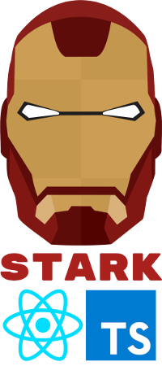

<p align="center">

</p>

> ## Stark Boilerplate

This boilerplate is now ready to integrate with Travis, Heroku and Coveralls for CI/CD

1. Create an account on [Heroku](https://www.heroku.com/), connect with your github and activate automatic deploy
2. Create a [Travis](https://travis-ci.org/) account, add your repository and add your heroku key in the settings
3. Create a [Coveralls](http://coveralls.io/) account and add your repository to code coverage

> ### Getting Started

```sh
# Clone repository
$ git clone https://github.com/brenofsena/stark-boilerplate-ts my-project

# install dependencies
$ cd my-project && yarn install

# run the project
$ yarn dev
```

> ### Commands

- `start`: runs server on `localhost:3001`
- `dev`: runs your application on `localhost:3333`
- `build`: creates the production version
- `test`: runs jest to test all components
- `test:watch`: runs jest in watch mode
- `test:ci`: runs jest for code coverage
- `test:cypress`: runs cypress to tests e2e
- `generate component`: generate a component
- `generate page`: generate a page
- `generate hook`: generate a hook
- `generate context`: generate a context

> ### Built with

- Webpack
- TypeScript
- React
- React Router DOM
- Styled Components
- Polished
- Jest
- React Testing Library
- Cypress
- Faker
- ESLint
- Prettier
- Husky
- Lint Staged
- Plop

[MIT License](./license) (c) Breno Sena
